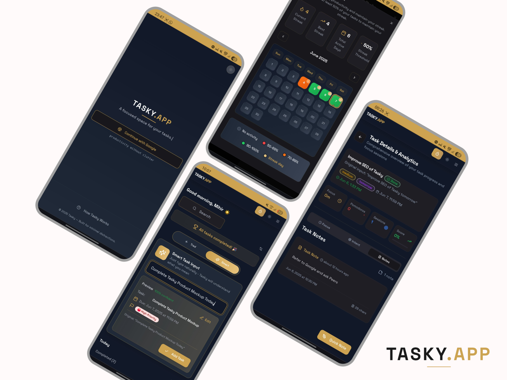
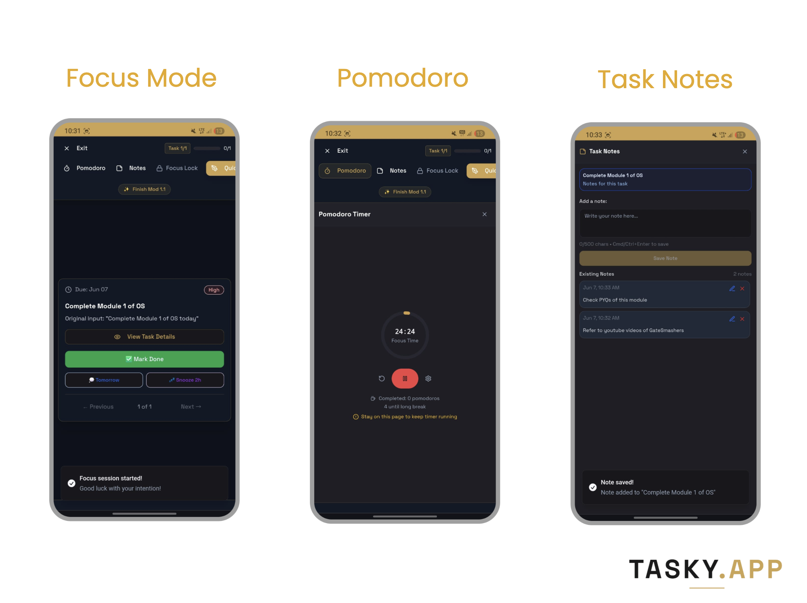
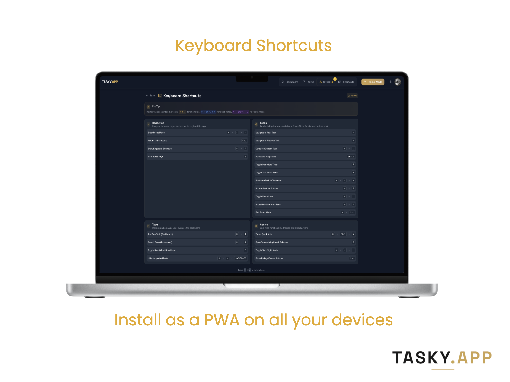

# ✨ Tasky - Smart Task Management and Focus Mode App

> **Your intelligent productivity companion for focused work and smart task management.**

Tasky combines AI-powered task management with powerful focus tools to help you achieve deep work and build lasting productivity habits.

[](https://taskyapp.xyz)

## 🌟 Core Features

### 📋 Smart Task Management

- **Natural Language Input**: Add tasks like "Call mom tomorrow at 2pm high priority"
- **Priority System**: High, medium, and low priority organization
- **Smart Scheduling**: Due dates, snoozing, and intelligent postponing
- **Real-time Sync**: Your tasks everywhere, always up-to-date

### 🎯 Focus Mode

- **Distraction-Free Environment**: Minimalist interface for deep work
- **Focus Lock**: Prevents exits during important sessions
- **Session Tracking**: Monitor your focus time and productivity

### 🍅 Pomodoro Timer

- **Integrated Timer**: Built-in pomodoro technique support
- **Customizable Settings**: Adjust work/break durations
- **Session Persistence**: Timer continues even when viewing shortcuts but you need to resume it again, to regain focus time

### 📈 Productivity Analytics

- **Streak Tracking**: Build and maintain productivity habits
- **Session Summaries**: Detailed insights into your focus sessions
- **Daily Statistics**: Track completed tasks and focus time
- **Progress Visualization**: See your productivity journey

### ⚡ Power User Features

- **Keyboard Shortcuts**: Lightning-fast navigation and actions
- **Quick Notes**: Capture thoughts without breaking focus
- **Bulk Operations**: Manage multiple tasks efficiently
- **Smart Search**: Find tasks instantly

## 📸 Product Snapshots


_Feature snapshots like streak, smart input and task analytics_


_Distraction-free focus mode with integrated pomodoro timer_


_Works with Keyboard Shortcuts on Desktop_

## 🚀 Quick Start

### Prerequisites

- Node.js 18+
- Firebase account
- Modern web browser

### Installation

```bash
# Clone the repository
git clone https://github.com/mihirphalke1/tasky.git
cd tasky

# Install dependencies
npm install

# Configure Firebase
cp .env.example .env

# Start development server
npm run dev
```

## ⌨️ Essential Shortcuts

### Global Shortcuts

| Action         | Mac                 | Windows                |
| -------------- | ------------------- | ---------------------- |
| Add Task       | `⌘ + J`             | `Ctrl + J`             |
| Search         | `⌘ + K`             | `Ctrl + K`             |
| Focus Mode     | `⌘ + Shift + Enter` | `Ctrl + Shift + Enter` |
| Quick Note     | `⌘ + Ctrl + N`      | `Ctrl + Alt + N`       |
| Show Shortcuts | `⌘ + /`             | `Ctrl + /`             |

### Focus Mode Shortcuts

| Action           | Mac         | Windows        |
| ---------------- | ----------- | -------------- |
| Complete Task    | `⌘ + Enter` | `Ctrl + Enter` |
| Next Task        | `→`         | `→`            |
| Previous Task    | `←`         | `←`            |
| Pomodoro Toggle  | `P`         | `P`            |
| Play/Pause Timer | `Space`     | `Space`        |
| Focus Lock       | `⌘ + L`     | `Ctrl + L`     |
| Snooze Task      | `⌘ + S`     | `Ctrl + S`     |
| Exit Focus       | `⌘ + Esc`   | `Ctrl + Esc`   |

## 🏗️ Tech Stack

### Frontend

- **React 18** - Modern React with hooks
- **TypeScript** - Type-safe development
- **Vite** - Lightning-fast build tool
- **Tailwind CSS** - Utility-first styling

### UI Components

- **Shadcn/ui** - Beautiful component library
- **Framer Motion** - Smooth animations
- **Lucide Icons** - Clean iconography
- **Sonner** - Elegant notifications

### Backend & Services

- **Firebase** - Auth, Firestore, hosting
- **Date-fns** - Date manipulation
- **React Router** - Client-side routing

## 🎨 Design Philosophy

- **Minimalism**: Clean, distraction-free interfaces
- **Accessibility**: Full keyboard navigation and screen reader support
- **Performance**: Optimized for speed with lazy loading
- **Responsiveness**: Seamless experience across all devices

---

<div align="center">

## **[Try Tasky](https://taskyapp.xyz)**

**You can request features or report bugs using contact developer form after logging into Tasky!**
<br>
Made with ❤️ for productivity enthusiasts everywhere!

_Stay focused. Stay productive. Stay awesome._

</div>
